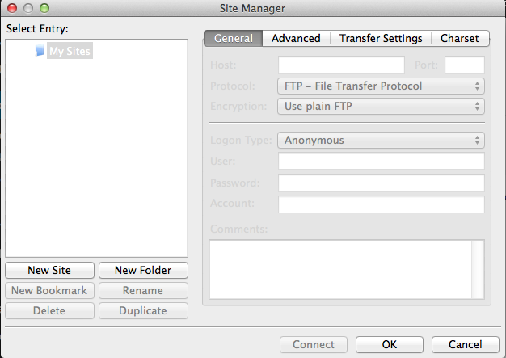
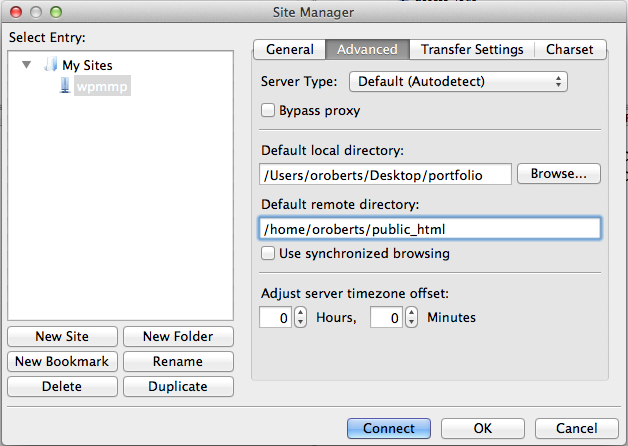
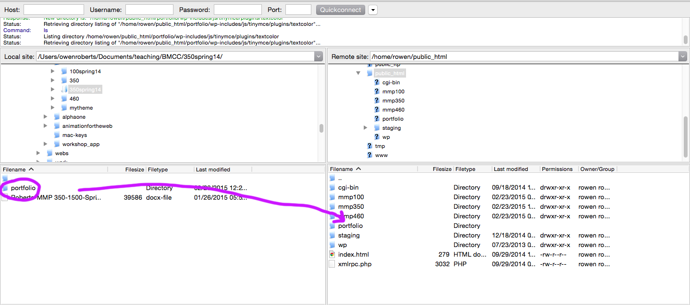

#Introduction to Foundation
We’re going to look at using the Foundation grid to implement the wireframes for our site.

Start by [downloading Foundation here](http://foundation.zurb.com/sites/download.html/).

Foundation provides many features to make site design implementation faster.  We want to start with a custom download that includes the grid elements only.  On the Customize Page choose only the Grid and Block Grid elements and the number of columns, gutter, and max-width for your layout.  Feel free to return to the Foundation documentation to try out the other features at another time.

We’re going to go over the [documentation](http://foundation.zurb.com/sites/docs/grid.html) for Grid and Block Grid today and use them to implement our wireframes.

We'll also take a look at the tag: `<meta name="viewport" content="width=device-width, initial-scale=1"/>`

## Set wpmmp server for template:
Open FileZilla.  Use the Site Manager to connect to your wpmmp server.  This can be opened with ⌘S or File > Site Manager.

Click the **New Site** button to create a new site.  Enter your server information.

Host: **wpmmp.bmcc.cuny.edu**

Protocol: SFTP

Logon Type: **Normal**

Username: For most of you this will be the first initial of your first name and the first seven letters of your last name, ie Owen Roberts is oroberts.  If this doesn’t work let me know and we’ll look yours up.

Password: Your **Cunyfirst ID**.  This is an 8 digit number.  If you don’t know it, ask me.

Then click the **Advanced** tab and select the local and remote path for you site.  Local path should be the folder where you WordPress files are located.  Remote path should be **/home/yourusername/public_html**

Leave everything else blank and hit **Connect**.

You may see a dialog box about security.  Click Ok.

Now drag your template/wireframe folder over to the remote folder.

Your site template will be live at **wpmmp.bmcc.cuny.edu/~username/projectfolder/**

Next week we'll install WordPress on these servers.

##Assignment 5
- Using your wireframes as an example, create a template for you website using Foundation, HTML and CSS
- Your website should have a homepage, single page and blank page template (about or bio for example)
- It should have three HTML files, one CSS file and the Foundation framework files
- Upload to the WPMMP server and submit URL via Blackboard