# Setting up WP servers and MySQL database
[Home]({{site.github.url}}/) > [Week 4]({{site.github.url}}/schedule.html#week-4)

To get started on setting up the server, we want to make sure that our development environment is ready to go.  We’re going to be editing the files for our WordPress blogs on our machines.  If you want to use your laptop or classroom computer that’s fine, at a later time we’ll go over methods for making the files available on multiple machines.

To start, create a directory (folder) on your computer where you will save the WordPress files.  I’m going to put mine on the Desktop.

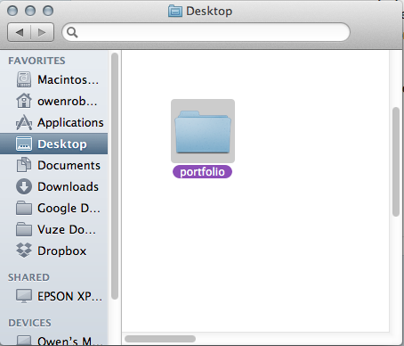

It’s important to start your project with good organization, because the files need to be transferred to the server in the correct directories for your website to work.

Once you have created you directory, download WordPress from the <a href="http://www.wordpress.org">WordPress.org</a> site.

When WordPress has finished downloading, unzip the package and move the files contained in the WordPress directory into your portfolio directory.  Do not move the folder itself.

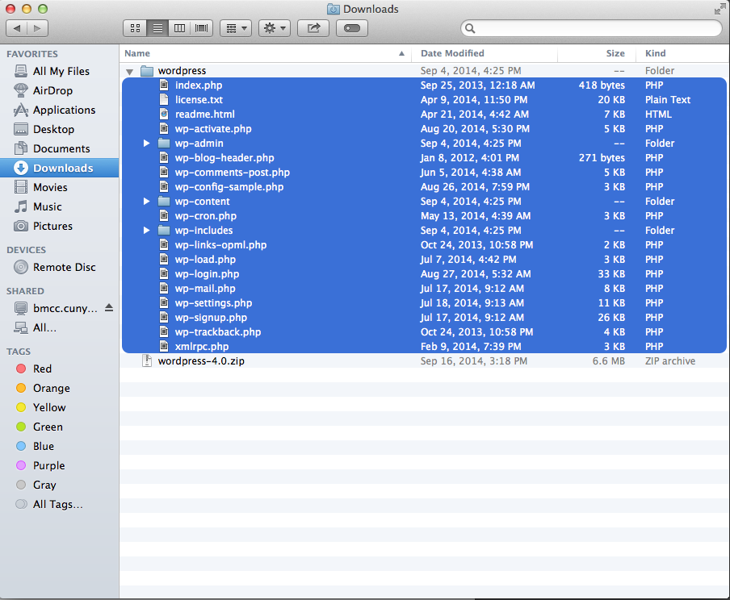

These are all of the files that will be uploaded to the server to install WordPress.

Now we will connect to the server.

## Set wpmmp server for template:
Open FileZilla.  Use the Site Manager to connect to your wpmmp server.  This can be opened with ⌘S or File > Site Manager.

Click the **New Site** button to create a new site.  Enter your server information.


Host: **wpmmp.bmcc.cuny.edu**

Protocol: **SFTP**

Logon Type: **Normal**

Username: For most of you this will be the first initial of your first name and the first seven letters of your last name, ie Owen Roberts is oroberts.  If this doesn’t work let me know and we’ll look yours up.

Password: Your **Cunyfirst ID**.  This is an 8 digit number.  If you don’t know it, ask me.

Then click the **Advanced** tab and select the local and remote path for you site.  Local path should be the folder where you WordPress files are located.  Remote path should be **/home/&lt;yourusername&gt;/public_html**

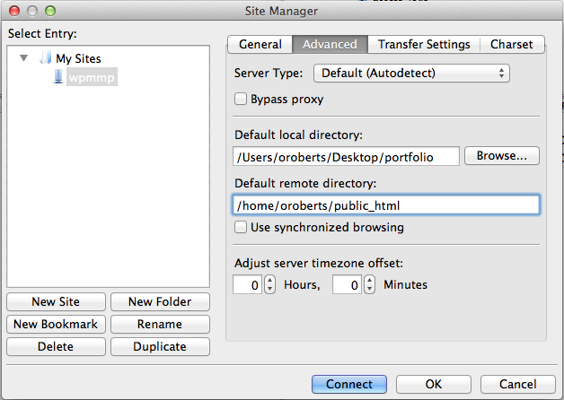

Leave everything else blank and hit **Connect**.

You may see a dialog box about security.  Click Ok.

Now drag your template/wireframe folder over to the remote folder.

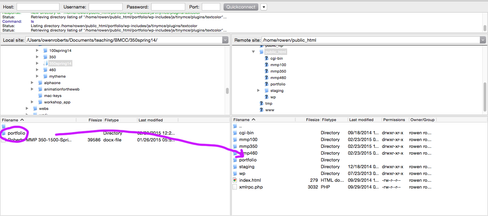

Your site template will be live at **wpmmp.bmcc.cuny.edu/~username/projectfolder/**

Once you have connected, use the same process to drag your new WordPress files and folder onto your server at the **public_html** directory.

Once this is done, you will be able to set up your WordPress install online.  

## Setting up WordPress on your server

Go to your server URL:

**wpmmp.bmcc.cuny.edu/~username/portfolio/**

You should see this (possibly after clicking through a security warning):

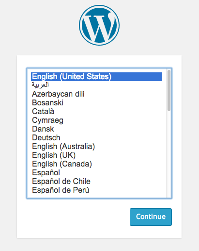

Here comes the tricky part!

You will see a window like this:

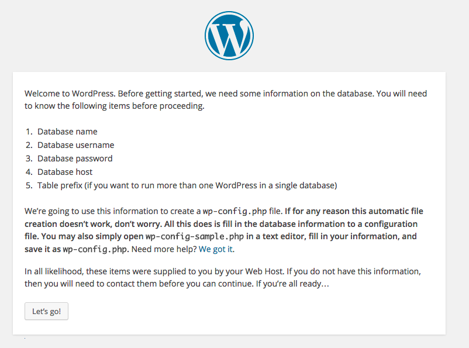

In order to actually install our WordPress server we need to create a database and establish a connection through MySQL.  Most modern web hosting companies will do all of this for you but we have to do a couple things ourselves.

First go to your server cPanel: [https://wpmmp.bmcc.cuny.edu:2083/](https://wpmmp.bmcc.cuny.edu:2083/)

Your username and password will be the same.

Once you are logged in look for the MySQL Databases icon.  Click that to create a new Database.

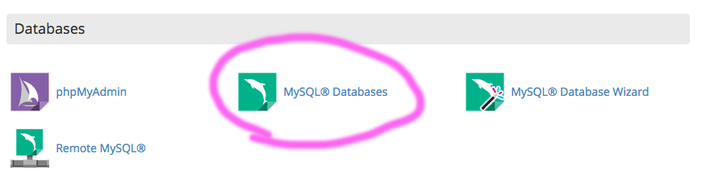

Fill in the **Create New Database** and write down the name of the database.  We can only have one, so make sure it is a generic name.  Once you have created the Database you should go to a new page.  Click “Go Back”.

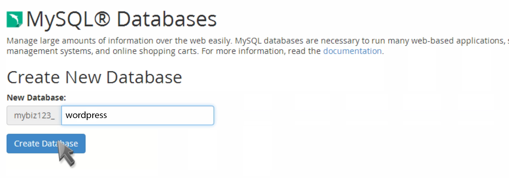

You will see this message:

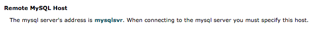

Remember the **mysqlsvr** token, we will need it in a minute.

Now we need to add a user:

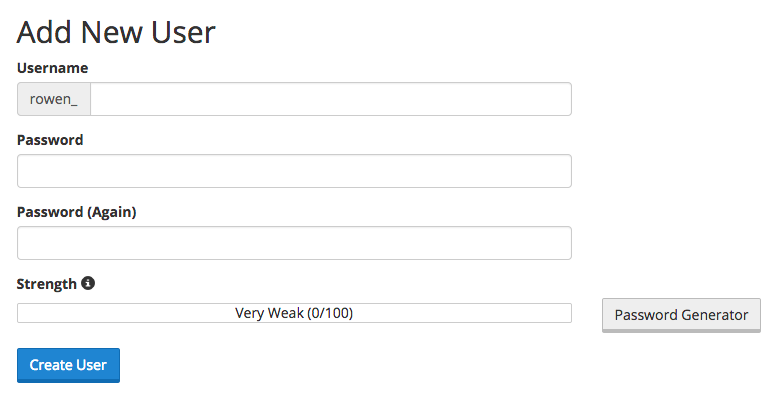

Create your user name.  This is only for the Database, so it doesn’t have to match your regular username, but you do have to remember it.  Fill in the password and click Create User.  Click “Go Back”.  Once the user has been created you still need to add it to the Database.  **Write down the username and password**.

Find “Add User to Database” and click Add.

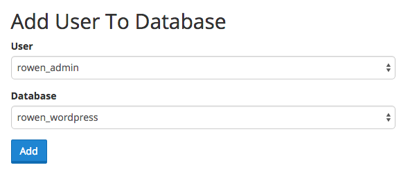

You will see a page for privileges.  Select the All Privileges button at the top:

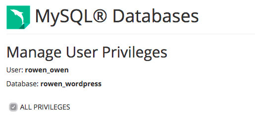

Click **Make Changes**.

Go back to your host page: **wpmmp.bmcc.cuny.edu/~yourname/portfolio**

Choose the language.

You will then need to fill in your database information here:

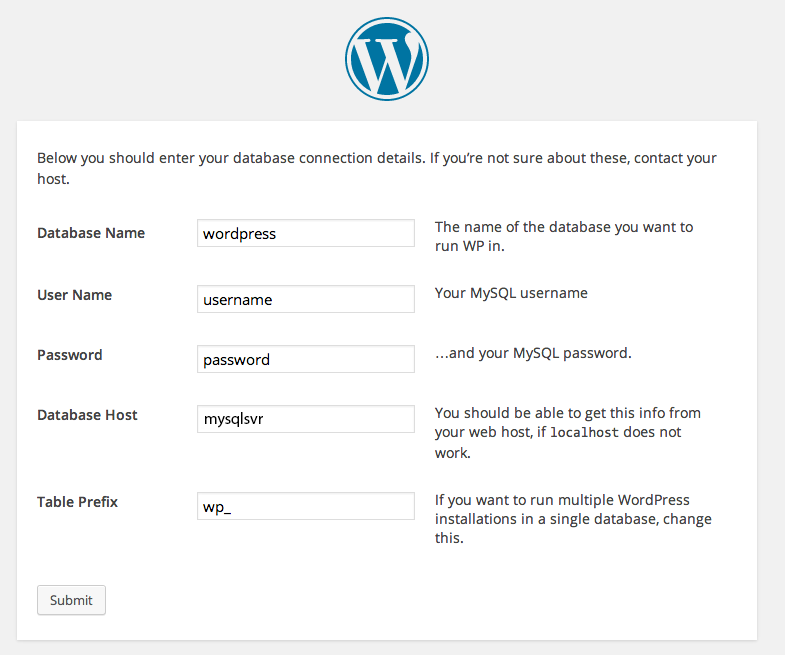

Again, this info is only for your database.  You will be able to choose a different username and login once the WordPress is connected.  For table prefix, use something like **wp_portfolio_**.  This is used to divide up the database so it can be used for more than one WP blog.  The under score will help make the file names easier to read and parse.

Click **Submit** and then click **Run the Install**.

You will now see this screen:

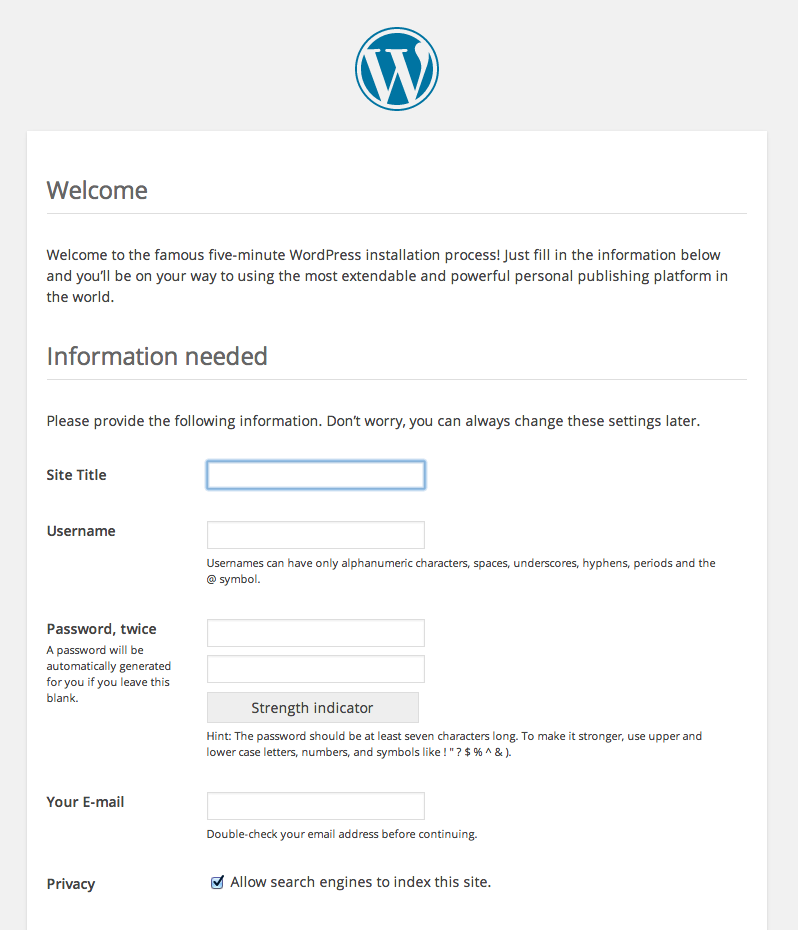

Fill in the info you want to use to actually log into your WordPress account.  Your username and password should be something you will remember.  They don’t have to be the username for FileZilla, or the Database.

Click **Install WordPress**.

Click **Login**.  You should see this:

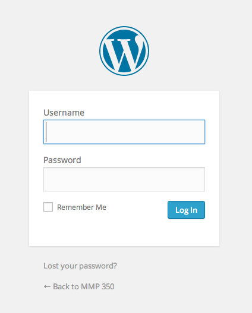

Remember the URL of that page because this is how you will log in to WordPress in the future.

It should be: **wpmmp.bmcc.cuny.edu/~yourusername/portfolio/wp-admin**

Don't forget the tilde **`~`** before your username.

Note that we will now be editing WordPress both online and from the files on your machine.  Use the online portal to add content, media, menus and categories.  We will use the files on our local drives to edit the theme of our portfolios.

<!---
**Edit**:

The may be an error with the WordPress servers which prevents uploading new content and themes through the Dashboard.

**Step 1**

In FileZilla, go to the root of your WordPress install and create a new folder called **tmp**.

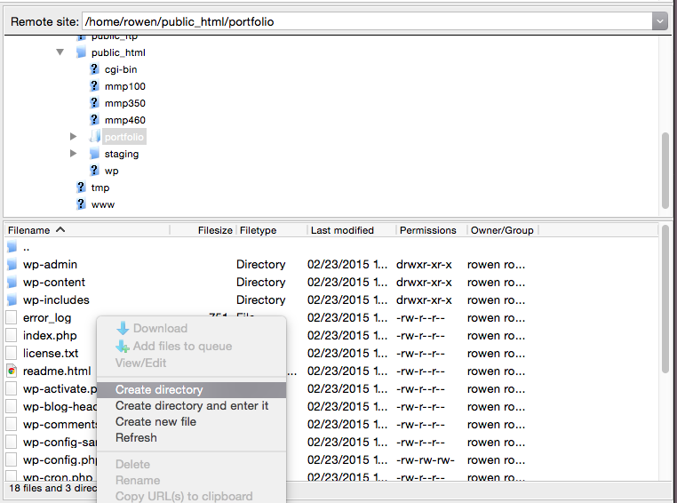

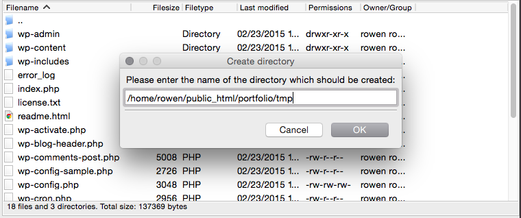

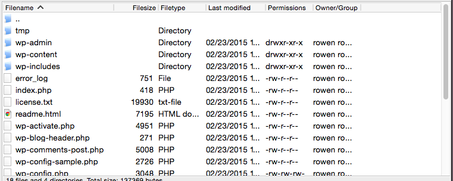

**Step 2**

Open Sublime Text.  Create a new document and paste this code into it:

```
upload_max_filesize = 16M
upload_tmp_dir = on
upload_tmp_dir = /home/username/public_html/portfolio/tmp
```

Make sure to replace username with your username.

Save the file as **php.ini** in your local WordPress install. 


Then upload that file using FileZilla.

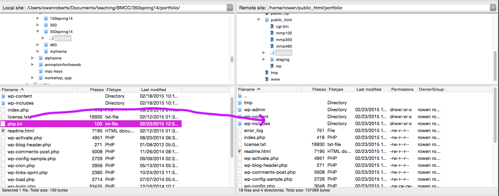

Open **wp-admin** on the remote site and upload the file again.

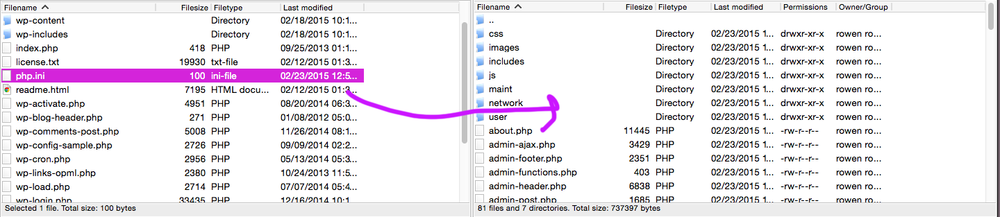

That’s it.  You will now be able to use the Dashboard, upload media, add new themes, and begin to develop your WordPress blog. 
--->

