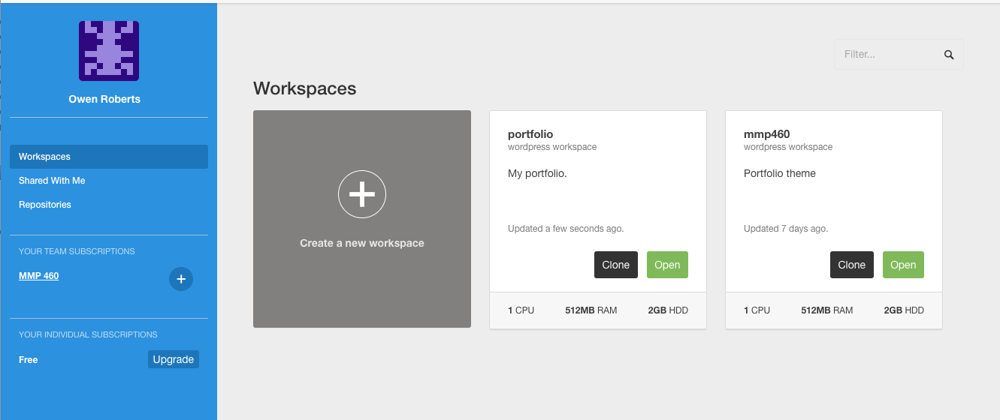
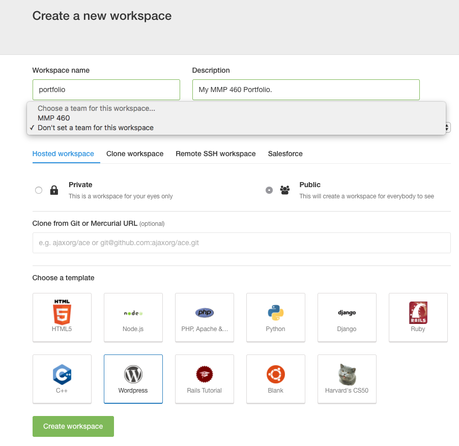
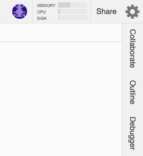
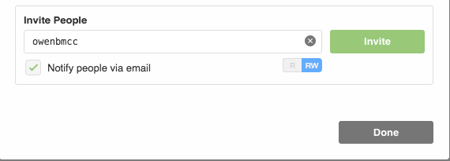
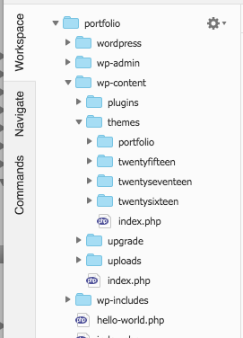
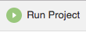
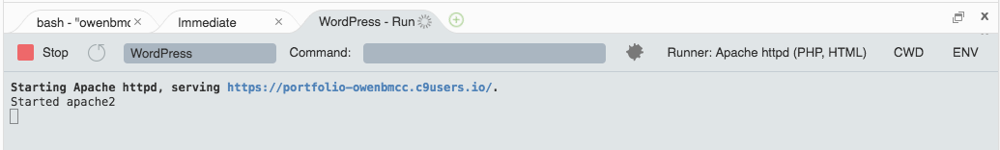

# Setting up a WordPress project on Cloud 9

[Home]({{site.github.url}}/) > [Week 6]({{site.github.url}}/schedule.html#week-6)

To create a new WordPress based workspace on Cloud 9, start by logging into [c9.io](https://c9.io/).  If you do not have an account, and you don't have an invite from me already, email or Slack message me the email address you want to use and I will send a new invite.



Once you have loaded the Dashboard, click <note>Create a new workspace</note>.  Name the workspace, click the WordPress button under <note>Choose a template</note> and make sure to set the team to <note>Don't set a team for this workspace</note> so you will be the owner of the workspace.



When you click <note>Create workspace</note> it will launch the Cloud 9 IDE.  This is where you can edit files and preview your work.  Once you are here, click the <note>Share</note> button to add me as a user.



Invite me using my <note>owenbmcc</note> Cloud 9 username, or my email.  This will allow me to view your code, launch your project and make edits or suggestions.



The left hand file browser has the default WordPress install files.  You can add your theme here by navigating to <note>portfolio > wp-content > themes</note>.



After uploading your theme you can open files to edit in the main window.  When you are ready to view the project, click the <note>Run Project</note> button at the top of the page.



This will launch the WordPress site at a url specified in the console.  You can click on this URL to view your work and also visit the Dashboard by adding ```/wp-admin/``` to the end of the URL.

