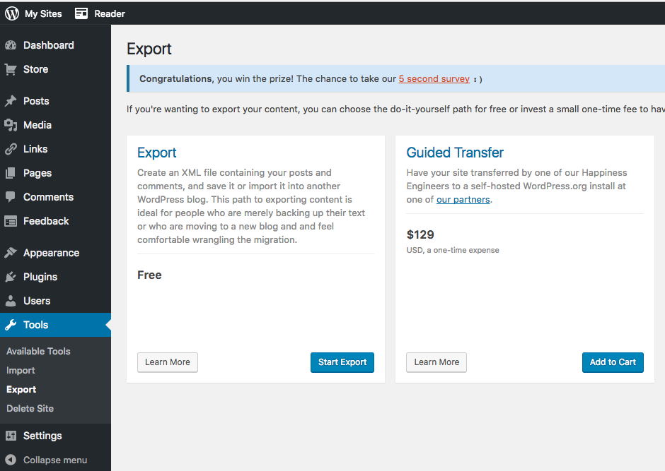
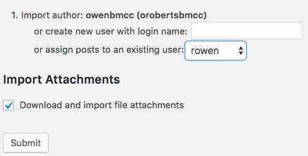

# Export/import WordPress content

[Home]({{site.github.url}}/) > [Week 6]({{site.github.url}}/schedule.html#week-6)

Migrating content between WordPress blogs is very easy using the Export and Import tools in the WordPress Dashboard.

Start by logging into the blog that you would like to export your data from.  If it is a wordpress.com blog, go to ```username.wordpress.com/wp-admin/``` and navigate to <note>Tools > Export</note>.



Use the Export Free option and click <note>Start Export</note>:


Unless you are certain you only want a portion of the data, choose to export all content and download export file:


This will download an xml file with the name of the blog and date: ```myblog.wordpress.2017-03-01.xml```

Next open the Dashboard of the blog you would like to import the files into.  If this is a Cloud 9 project, make sure to run your Cloud 9 project and then navigate to the URL in your browser.  If it is on the wpmmp server, you can go to the URL ```wpmmp.bmcc.cuny.edu/~username/blogname```.


Find the WordPress Import plugin and click <note>Install Now</note>.


Once installed, click Run Importer.


Choose the .xml file that you exported from the previous blog and click <note>Upload file and import</note>.


You can then choose to download and import file attachments and assign an author to the posts that will be imported.



You will now have the content you created for the previous blog saved in the new instance.